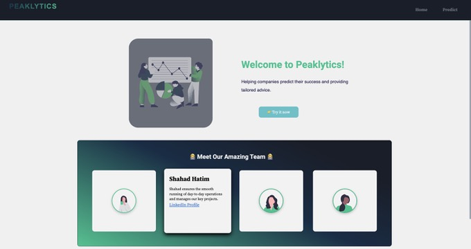
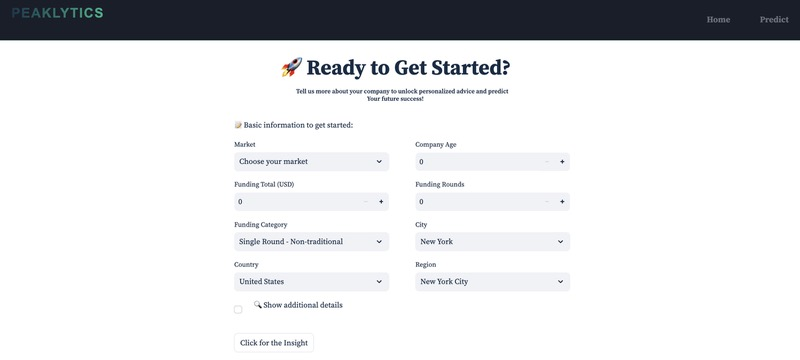
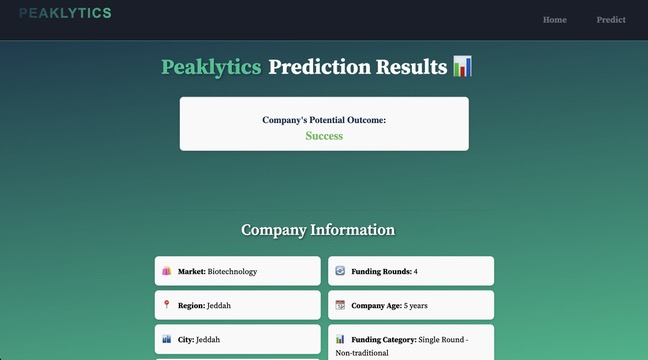

# Peaklytics 📈

Welcome to **Peaklytics**! This data-driven solution is designed to empower businesses by predicting potential outcomes and providing actionable insights to drive success. Built as part of the **Data Science Bootcamp** by the **Saudi Digital Academy** in partnership with **Le Wagon**, Peaklytics represents a culmination of data science techniques and collaborative effort.

## Table of Contents

- [Project Overview](#project-overview)
- [Key Features](#key-features)
- [Installation](#installation)
- [Usage](#usage)
- [Technical Details](#technical-details)
- [Screenshots](#screenshots)
- [Roadmap](#roadmap)
- [Contributing](#contributing)
- [License](#license)
- [Acknowledgments](#acknowledgments)

## Project Overview

Peaklytics is a predictive tool tailored to support businesses in their strategic planning. It provides users with insights into their likelihood of success, leveraging machine learning models to analyze key business attributes. This project was built by a team of data science enthusiasts committed to solving real-world problems.

### Our Vision

**Predict, Achieve, Thrive** — empowering startups and established businesses alike with data-driven predictions and tailored advice.

## Key Features

- **Predictive Analytics**: Estimates the likelihood of success for a business based on user input.
- **Actionable Insights**: Offers recommendations that help businesses make informed decisions.
- **User-Friendly Interface**: Streamlined, intuitive design for easy navigation and input.
- **Adaptability**: Can be customized for different industries and market conditions.

## Installation

1. **Clone the Repository**:
   ```bash
   git clone https://github.com/yourusername/peaklytics.git
   cd peaklytics
   ```

2. **Install Requirements**:
   ```bash
   pip install -r requirements.txt
   ```

3. **Run the Application**:
   Use Docker or run the app locally:
   ```bash
   # Local
   streamlit run app.py
   
   # Docker
   docker build -t peaklytics .
   docker run -p 8501:8501 peaklytics
   ```

## Usage

1. **Run the Application**:
   Start the Streamlit app with `streamlit run app.py`.
   
2. **Input Data**:  
   - Enter business details like market, funding type, region, and company age.
   - Access additional insights by clicking on "Show additional details."
   
3. **View Prediction Results**:
   - The application will provide an outcome prediction (e.g., Success) and display detailed insights and recommendations.

4. **Analyze Results**:
   Use the insights to inform your business strategies and decision-making.

## Technical Details

- **Frontend**: Built with [Streamlit](https://streamlit.io/) for a clean, interactive user experience.
- **Backend**: Powered by [FastAPI](https://fastapi.tiangolo.com/) to handle predictions and API requests.
- **Machine Learning Model**: A model trained on historical business data to predict success likelihood.
- **Data Preprocessing**: Utilizes SMOTE for handling imbalances, one-hot encoding for categorical features, and IQR for outlier detection.

## Screenshots

### 1. Welcome Page


### 2. User Input


### 3. Prediction Results


These screenshots showcase the user experience from start to finish!

## Roadmap

- **Improved Model**: Enhance model accuracy by experimenting with advanced algorithms.
- **More Customizable Insights**: Allow users to customize insight parameters for industry-specific recommendations.
- **Expanded Market Data**: Integrate additional datasets to cover more business sectors.
- **Localization**: Add multi-language support for a global audience.

## Contributing

We welcome contributions from the community! To contribute:

1. Fork the repository.
2. Create a new branch (`git checkout -b feature/new-feature`).
3. Commit your changes (`git commit -m 'Add new feature'`).
4. Push to the branch (`git push origin feature/new-feature`).
5. Open a Pull Request.

## License

This project is licensed under the MIT License. See [LICENSE](LICENSE) for more details.

## Acknowledgments

A big thank you to the **Saudi Digital Academy** and **Le Wagon** for their support throughout this project. We also want to recognize our amazing TAs and team members for their creativity, patience, and dedication.
